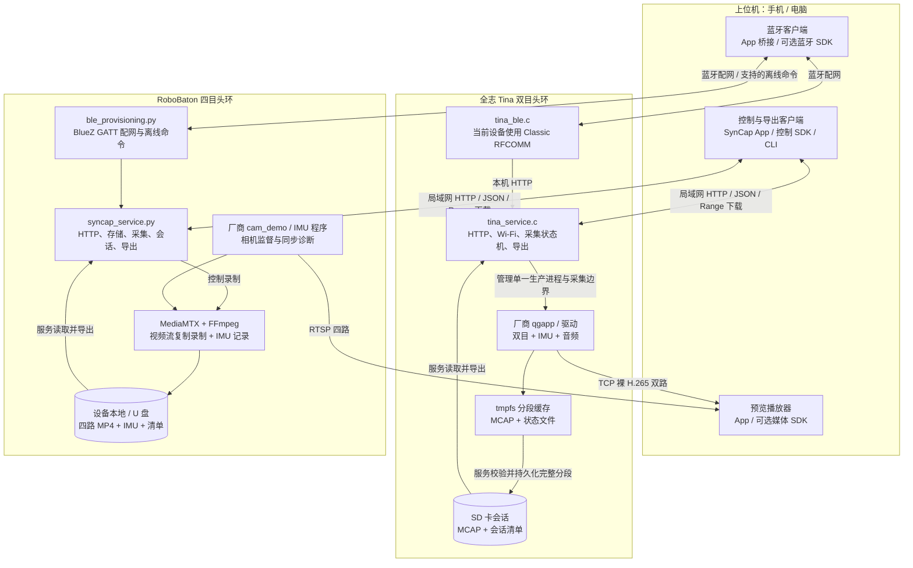
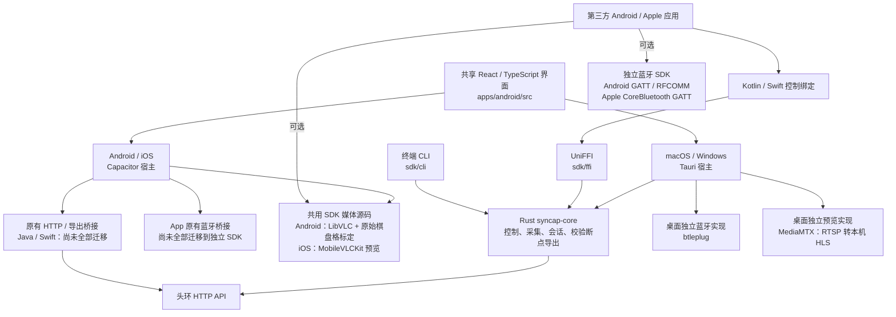

# 当前架构与模块关系

代码核对日期：2026-09-13。本页描述已有实现，不把协议草案、未来设备 SDK 或未经验收的平台画成已完成能力。验证范围见 [交付记录](../sdk/RELEASE_2026_09_13.md)，构建步骤见 [开发指南](DEVELOPMENT.md)。

**`sdk/` 运行在上位机；`device/` 运行在头环。** 头环端目前是 RoboBaton 和 Tina 两套适配服务，尚未提取成统一可复用的设备端 SDK。

## 1. 部署与数据链路

图中播放器、蓝牙模块按平台和设备能力选择，不代表每个平台都支持全部传输方式。CLI 只提供 HTTP 控制与导出，不含蓝牙或播放器。

- 普通 Wi-Fi 和手机自身热点都可以提供局域网。Wi-Fi 列表由头环扫描，配网成功后上位机还需能访问头环的实际地址；不要求公网。
- 录制文件在头环端生成并保存，预览是独立传输链路。采集不是在手机上保存预览截图；但录制视频仍可能使用硬件压缩编码，不能称为未经压缩的原始图像。
- 导出通过 HTTP Range 续传并核对文件大小、SHA-256 和会话清单。传输校验通过不等于每帧解码、曝光同步或标定质量已经通过。
- 标定只接受设备明确提供的同步原始快照及其元数据，不从压缩预览替代取图。当前 Tina 不提供所需原始 NV12 标定快照。

设备实现细节：[Tina 服务](../device/README-Tina.md)、[RoboBaton 服务](../device/README.md)。

## 2. App 与 SDK 的真实复用关系

箭头表示调用或依赖；“可选”表示第三方宿主按需引入，不是控制 SDK 的强制依赖。

这不是“整个 App 已经完全 SDK 化”：桌面控制已调用 Rust core，移动 App 已共用 SDK 媒体模块，但 HTTP、导出与蓝牙仍有原有桥接实现。系统权限、文件选择、界面与后台生命周期由宿主负责。

## 3. 源码入口

`apps/android/` 是历史目录名，包含共享界面及三类宿主，不只是 Android。构建 App 需要保留仓库目录关系，不能只下载其中的原生工程子目录。

| 部分 | 源码 / 文档 |
| --- | --- |
| App 共享界面与平台分发 | [Prototype.tsx](../apps/android/src/Prototype.tsx)、[nativeDevice.ts](../apps/android/src/nativeDevice.ts) |
| Android 宿主 | [Android 工程](../apps/android/android/)、[设备桥接](../apps/android/android/app/src/main/java/com/syncap/studio/SynCapDevicePlugin.java) |
| iOS 宿主 | [iOS 工程](../apps/android/ios/)、[设备桥接](../apps/android/ios/App/CapApp-SPM/Sources/CapApp-SPM/SynCapDevicePlugin.swift) |
| macOS / Windows 宿主 | [Tauri 工程](../apps/android/src-tauri/)、[平台实现](../apps/android/src-tauri/src/lib.rs) |
| 控制 SDK、跨语言绑定、终端 | [Rust core](../sdk/core/)、[UniFFI](../sdk/ffi/)、[CLI](../sdk/cli/) |
| Android 独立 SDK 与例程 | [Android SDK](../sdk/android/README.md)、[独立消费示例](../sdk/android/consumer/) |
| Apple 独立 SDK | [控制 SDK](../sdk/apple/README.md)、[蓝牙](../sdk/apple/BLUETOOTH.md)、[媒体](../sdk/apple-media/README.md) |
| 头环端实现 | [Tina C 服务](../device/tina_service.c)、[RoboBaton Python 服务](../device/syncap_service.py) |
| 协议与实际支持范围 | [协议文档](syncap-device-protocol-v1.md)、[SDK 当前范围](../sdk/README.md) |

生成的 Kotlin / Swift 绑定及第三方二进制依赖通过 [构建脚本与说明](DEVELOPMENT.md) 恢复，不将构建缓存、固件、密钥或用户录制提交到源码仓库。

## 4. 尚未完成的边界

- 头环端统一设备 SDK、鸿蒙绑定尚未实现。已有服务适配不等于支持任意摄像头固件。
- iPhone 全链路未验收，Apple 标定未实现。当前 Tina Classic 配网不能通过 iPhone 的 CoreBluetooth 使用；Tina 蓝牙辅助程序只有成功注册 GATT 时才提供该通道。
- 当前桌面播放器只支持 RTSP，不支持 Tina 的 TCP 裸 H.265；不能把已有桌面宿主等同于双目全功能可用。
- Tina 原厂程序仍有 IMU/I2C 与编码停滞、视频起点参考帧缺失的问题；服务故障保护必须保留，不能通过放宽完整性检查宣称修复。
- Tina 的硬件触发不等于已经测得零同步误差；当前 PTP 为不支持，未知曝光误差保持未知。
- 当前使用可信局域网 HTTP。协议文档中的 TLS、CBOR、WebSocket 等设计不能视为均已实现，固定兼容认领值也不是安全认证。
